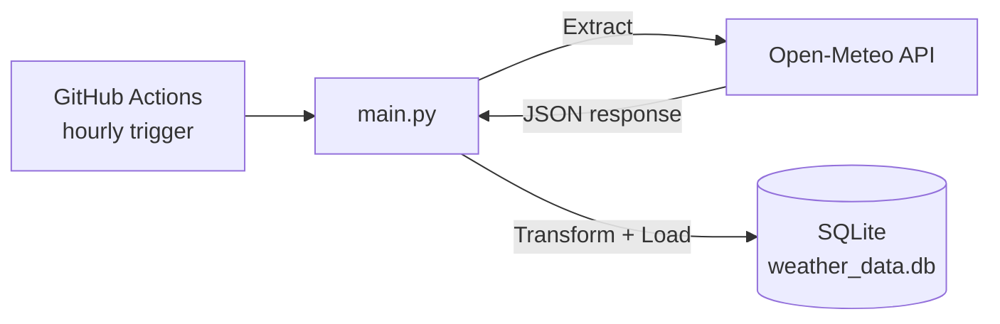

# Weather ETL Pipeline

Automated ETL pipeline extracting live weather data hourly via GitHub Actions, with fail-loud error handling and typed SQLite storage.

## What it does

- **Extract** — calls the [Open-Meteo API](https://open-meteo.com/) (no API key required) for current temperature and humidity.
- **Transform** — casts the raw JSON response into typed fields (float temperature, integer humidity) and attaches a timestamp.
- **Load** — inserts the record into a local SQLite database (`weather_data.db`), creating the `weather` table automatically on first run.
- **Orchestrate** — a GitHub Actions workflow runs the script hourly; there's no server or external scheduler involved.

## Architecture

## Design choices

- **Zero-cost infrastructure** — Open-Meteo needs no API key, and GitHub Actions provides the scheduler, so the whole pipeline runs for free with nothing to host.
- **Fails loudly, not silently** — any exception (network failure, unexpected API response, etc.) is caught, logged, and the script exits with a non-zero status, so a broken run shows up as a failed Actions job rather than quietly skipping a load.
- **Idempotent setup** — `CREATE TABLE IF NOT EXISTS` means the pipeline runs safely on a fresh checkout with no manual setup step.

## Tech stack

Python · `requests` · `sqlite3` · GitHub Actions (hourly schedule)

## Possible next steps

- Parameterize the city instead of hardcoding it
- Add a basic data-quality check (reject clearly invalid temperature/humidity values) before insert
- Swap SQLite for a cloud warehouse (e.g. Snowflake) as a closer analog to production-scale ingestion
